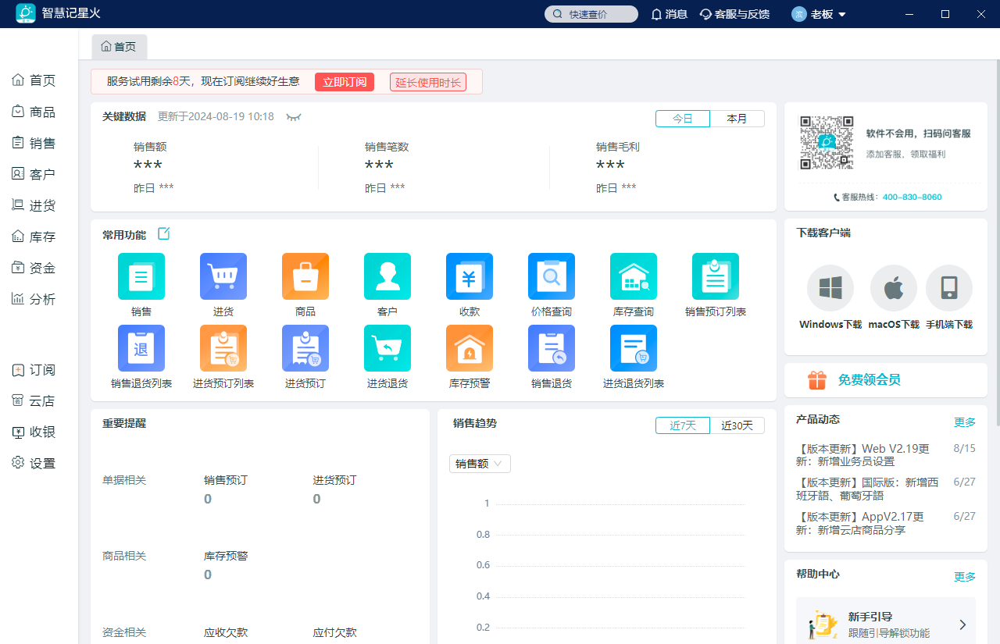
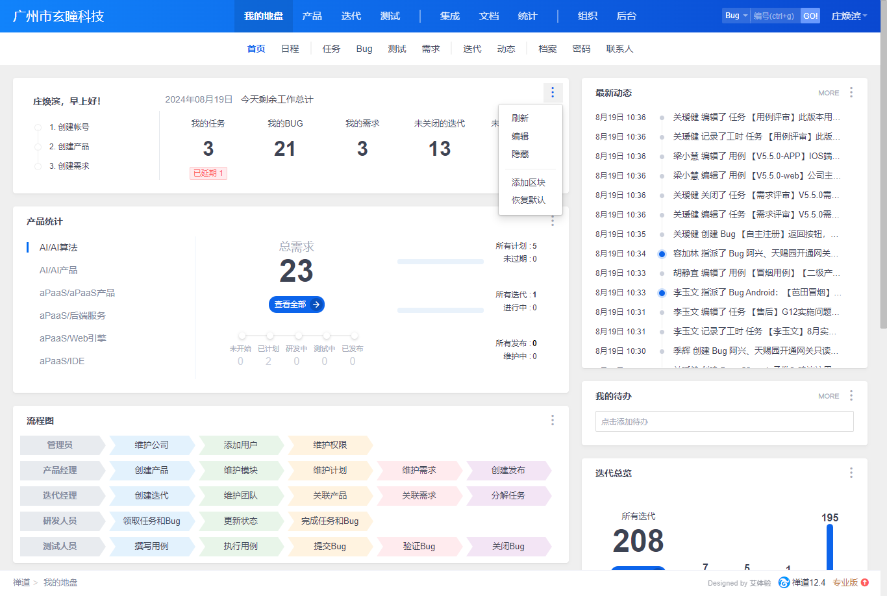

# 门户首页

**需求确认结论？？**
+ 原有的门户引擎是否能满足SMB首页的需求
+ 是否做成固定首页，还是需要分职位，分端（web h5 App）配置，颗粒度如何？
+ 是否支持使用者自定义首页模块（拖动更改模块位置、添加移除模块、）
+ 是否支持常用功能/导航（或者放在导航栏）
+ 需要增加哪些模块？

| 对比 | 沿用门户引擎 | 重新规划重新开发 |
| ---- | ---- | ---- |
| 优点 | 1、节省开发资源 |  |
| 缺点 | 1、依赖低码表单+低码接口，中长期计划需要剔除依赖低码部分 2、配置较为繁琐 3、目前功能可能不契合SMB需求，需要改造 |  |

