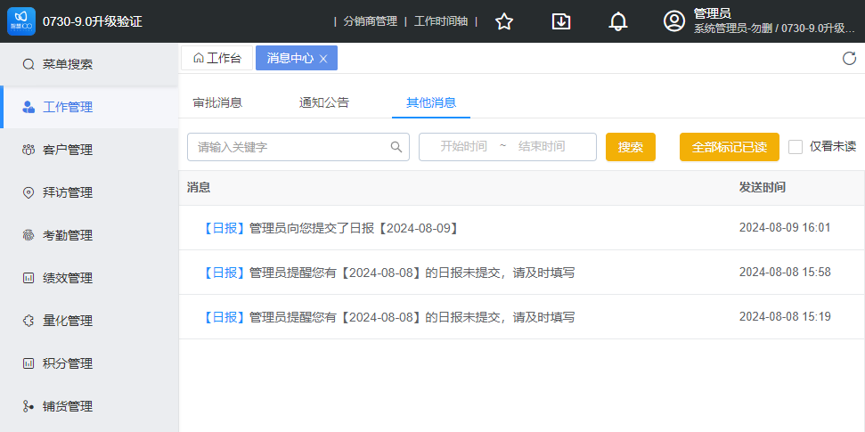

## web包

+ 容器包-smb产品独立（通过平台引擎包开放的API、接口、插槽等方式接入smb产品特有功能）
+ 引擎包-引用平台引擎包
+ smb容器包 + 平台引擎包 = 独立打包smb-web包

## 消息中心

目前的web消息中心分为三个tab，支持打开审批消息、低码页面、最新版补丁包也支持打开SPU页面。

建议：暂时维持现状，后续如有新需求（如对接第三方消息）再另行改造。

## 官网+帮助文档（产品Q&A知识库）

官网：
+ 直销或者分销，都需要一个官网的推广渠道？门面很重要。
+ 如何推广？广告，seo...
+ 官网内容：产品介绍，帮助文档，免费注册体验，产品售卖+在线支付...
+ 智慧记官网：https://www.zhihuiji.cn/

帮助文档（产品Q&A知识库）：
+ 当用户遇到问题时，如果他希望获得一个系统性的全面解答，那么这时候需要建立起一个产品的Q&A知识库，在用户使用系统期间随时随地都可以前往查询。
+ 这个知识库的内容设计，需要大量的人力成本，最好先按照用户能够理解的实际线下业务模块划分，划分好后再按照各个功能的流程进行详细的描述和说明。
+ https://www.zhihuiji.cn/help/doc/1386
