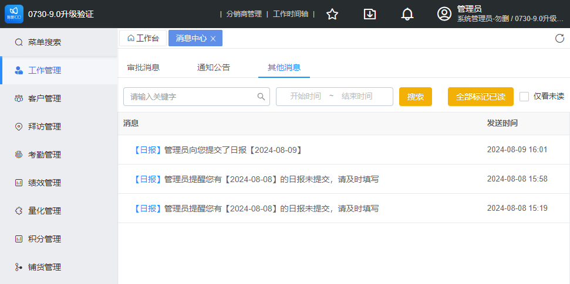

## web包

**技术架构**
+ 容器包-smb产品独立（通过平台引擎包开放的API、接口、插槽等方式接入smb产品特有功能）
+ 引擎包-引用平台引擎包
+ smb容器包 + 平台引擎包 = 独立打包smb-web包

**问题**
+ 需要平台支援：
  - 平台引擎包提供API、接口、插槽等方式支持接入smb产品特有功能
  - 一些分离不出来的功能，平台做成配置项

<!-- ## 消息中心

目前的web消息中心分为三个tab，支持打开审批消息、低码页面、最新版补丁包也支持打开SPU页面。 -->

## 工作流引擎-前端问题

**参考资料**
+ https://juejin.cn/post/7156530891576049671
+ https://juejin.cn/post/7025979116679593998
+ https://blog.csdn.net/ishadian/article/details/103841140
+ https://cloud.tencent.com/developer/article/1998217
+ https://segmentfault.com/a/1190000041273775
+ https://blog.csdn.net/qq_40366738/article/details/128768412

+ 采用SPU技术架构实现 or 引擎系统集成？【如果是引擎系统集成的话需要平台APP实现？】
+ 是否需要集成Web配置端，开放给用户配置？
+ web配置端：集成 modeler 流程设计器
  - 如何关联外部表单（SPU-页面）？
  - 如何关联业务对象，业务对象标志属性？
  - 是否需要特殊功能定制？
+ 应用端
  - 集成流程中心（web、移动端）
  - 集成发起审批（web、移动端）
  - 集成消息中心-审批消息（web、移动端）
  - 审批时集成SPU-表单，前端如何实现数据对接？

<!-- 
## 官网+帮助文档（产品Q&A知识库）

官网：
+ 直销或者分销，都需要一个官网的推广渠道？门面很重要。
+ 如何推广？广告，seo...
+ 官网内容：产品介绍，帮助文档，免费注册体验，产品售卖+在线支付...
+ 智慧记官网：https://www.zhihuiji.cn/

帮助文档（产品Q&A知识库）：
+ 当用户遇到问题时，如果他希望获得一个系统性的全面解答，那么这时候需要建立起一个产品的Q&A知识库，在用户使用系统期间随时随地都可以前往查询。
+ 这个知识库的内容设计，需要大量的人力成本，最好先按照用户能够理解的实际线下业务模块划分，划分好后再按照各个功能的流程进行详细的描述和说明。
+ https://www.zhihuiji.cn/help/doc/1386 -->
