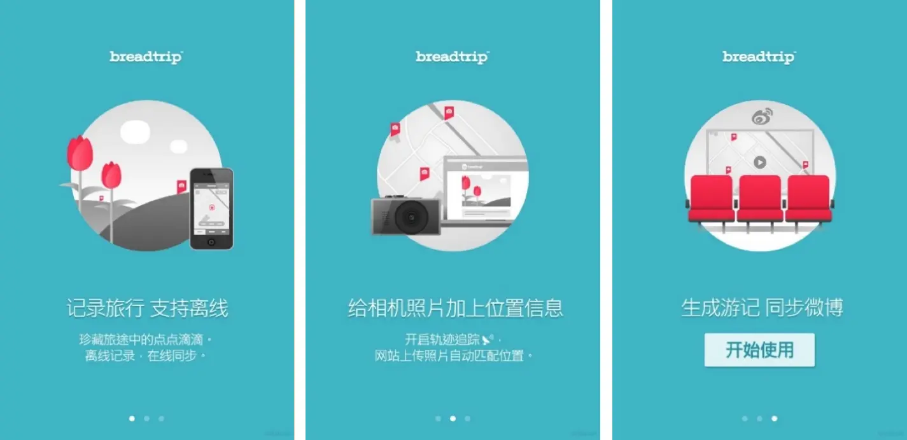
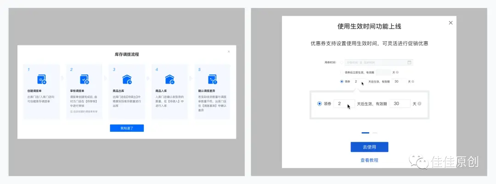
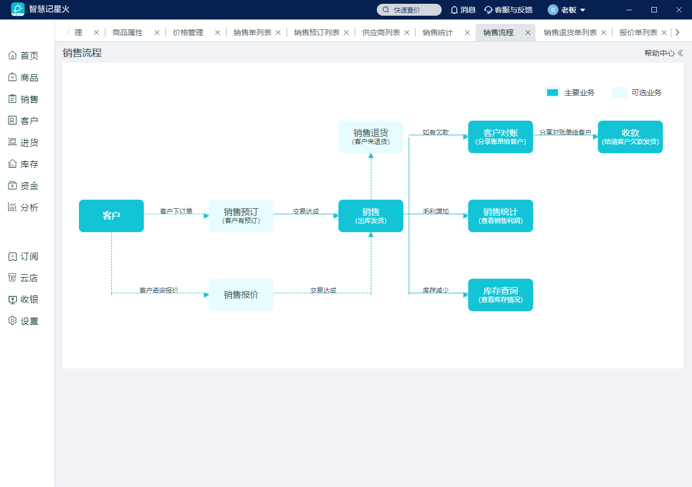
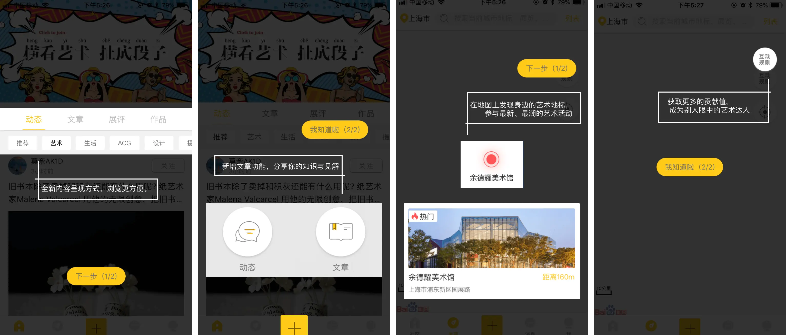
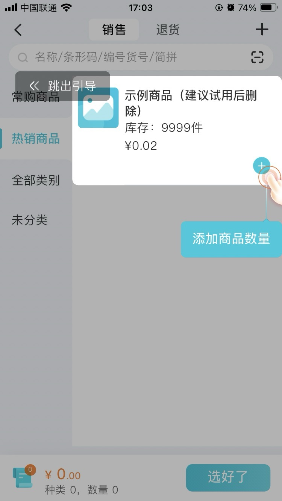

# 操作指引

操作指引是产品中非常常见的产品功能。优质的产品引导功能，可以使用户在较短时间内了解产品的特性，熟悉产品的功能，增强用户对产品的好感与信任感，最终提升用户转化率，从而促进业务的持续增长。

**参考资料**
+ https://www.woshipm.com/pd/5581082.html
+ https://www.woshipm.com/ucd/1012769.html
+ https://baijiahao.baidu.com/s?id=1797104353933447276&wfr=spider&for=pc

### 展示形式

**1、全局引导：当打开APP或者打开web应用时，弹出全局引导，表示为多张轮播图轮播切换展示，一般用于产品宣传，介绍**

**2、新手配置引导：当打开某个模块页面时，弹出引导内容，多用于工具类或是SaaS类产品，为用户显示详细的配置流程指引，或者提供相应的文档入口。**

**3、分步引导：包含上一步，下一步，跳过，进度指示器等**

**4、分步教学式引导：指引用户进行某个流程操作，常用于界面相对复杂或完整交互流程比较长的工具类产品，带领用户快速了解每个功能的收纳位置，或让用户以最短路径完整体验一遍操作流程。**

### 技术方案
+ 需求需要先确定采用哪种展示形式？
+ 实现方式：自定义实现/Intro.js/Shepherd.js/Tourbus.js
+ 封装为系统运营模块，统一实现配置，下发等操作。
+ 各个模块各自实现。

| 对比 | 统一封装实现 | 模块各自实现 |
| ---- | ---- | ---- |
| 优点 | 1、可配置化，可随时针对某个页面出操作指引 2、可编辑、可删除 | 1、可以做教学式引导 |
| 缺点 | 1、不支持教学式引导 2、需要良好的技术设计，适配不同屏幕尺寸是个问题 | 1、修改需重新发布SPU模块 |

**需求确认结论？？**
+ ...
